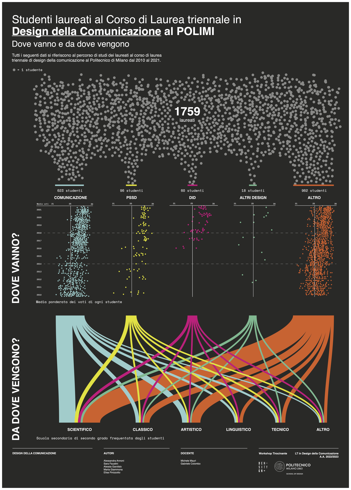

# Workshop Tirocinante 2023

Results of the "Workshop Tirocinante" held in June 2023 at the Design School, Politecnico di Milano.

**Teachers:**

[Michele Mauri](https://orcid.org/0000-0003-1189-9624), [Gabriele Colombo](https://orcid.org/0000-0003-0845-1757)

**Venue:**

[Design School, Politecnico di Milano](https://www.designdellacomunicazione.polimi.it/en/ddc-eng/)

**Dates:**

5 - 9 June 2023

**Abstract:**

The task given to students was to produce a visual poster showcasing the progression of the BSc and MSc Degree in Communication Design at Politecnico using data visualization techniques. Working in groups of four, the students dedicated a week to complete the project.

# Course Results

## Studenti laureati al Corso di Laurea triennale in Design della Comunicazione al POLIMI: dove vanno e da dove vengono

**_Graduates of the Bachelor's Degree in Communication Design at POLIMI: where they go and where they come from_**

[Download PDF](pdf/group-01.pdf)

##
