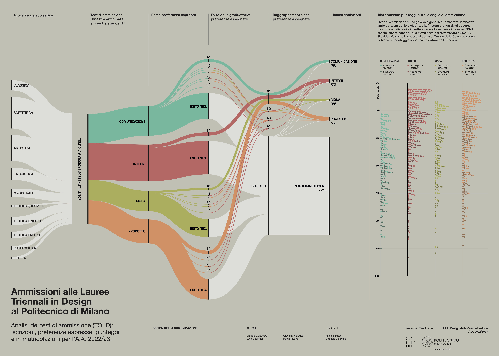

# Workshop Tirocinante 2023

Results of the "Workshop Tirocinante" held in June 2023 at the Design School, Politecnico di Milano.

**Teachers:**

[Michele Mauri](https://orcid.org/0000-0003-1189-9624), [Gabriele Colombo](https://orcid.org/0000-0003-0845-1757)

**Venue:**

[Design School, Politecnico di Milano](https://www.designdellacomunicazione.polimi.it/en/ddc-eng/)

**Dates:**

5 - 9 June 2023

**Abstract:**

The task given to students was to produce a visual poster showcasing the progression of the BSc and MSc Degree in Communication Design at Politecnico using data visualization techniques. Working in groups of four, the students dedicated a week to complete the project.

# Course Results

## Studenti laureati al Corso di Laurea triennale in Design della Comunicazione al POLIMI: dove vanno e da dove vengono

**_Graduates of the Bachelor's Degree in Communication Design at POLIMI: where they go and where they come from_**

Authors: Annoni Alessandra, Faustini Sara, Garofalo Alessia, Giammona Marta, Pinizzotto Elisa

[Download PDF](pdf/group-01.pdf)

## In che modo i cambiamenti sociali influenzano il design della comunicazione? Analisi delle keywords nelle tesi di laurea magistrale

**_How do social changes influence communication design? An analysis of keywords in master's theses_**

Authors: Bertocchi Sara, Cozzarini Anna, Crea Lucia, Previti Martina, Vittone Gaia

[Download PDF](pdf/group-02.pdf)

## Sapere Politecnico - qual è il background degli iscritti al corso in design della comunicazione?

**_What is the background of the students enrolled in the Communication Design course?_**

Authors: Bellani Sara, D'Orsi Alessia Maria, Favaretto Giorgia, Mutti Beatrice, Polerà Alice

[Download PDF](pdf/group-03.pdf)

## Percorsi scolastici e Design della Comunicazione al Politecnico di Milano. C’è correlazione tra voto di maturità e voto di laurea?

**_Educational background and Communication Design at Politecnico di Milano. Is there a correlation between high school grade and university grade?_**

Authors: Balossi Manuela, Barzaghi Sara, Germanò Giada, Ricco Federico, Taglialatela Luca Luigi

[Download PDF](pdf/group-04.pdf)

## Ammissioni alle Lauree Triennali in Design al Politecnico di Milano. Una analisi dei test di ammissione (TOLD)

**_Admissions to the Bachelor's Degrees in Design at Politecnico di Milano. An analysis of admission tests (TOLD)_**

Authors: Galbusera Daniele, Gottifredi Luca, Malausa Giovanni, Rapino Paola

[Download PDF](pdf/group-05.pdf)

